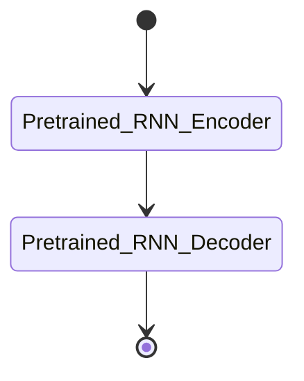

# T**Brain-to-text '25**

## **Brief**

Kaggle competition built on the model [Neuroprosthetics-Lab `nejm-brain-to-text`](https://github.com/Neuroprosthetics-Lab/nejm-brain-to-text)
baseline: decode attempted-speech neural activity from an intracortical
brain-computer interface (BCI) into text.

## Objective

Given `t15_copyTask_neuralData` (per-trial neural feature sequences, HDF5)
recorded while a participant attempted to speak a cued sentence, predict the
sentence text. Evaluated on **Word Error Rate (WER)**, computed lowercase
and without punctuation.

## Data

- `t15_copyTask_neuralData/hdf5_data_final` — neural feature sequences per
  trial (see `src/main.py::load_h5py_file`, `BrainToTextDataset`).
- `t15_pretrained_rnn_baseline` — the competition-provided baseline RNN
  checkpoint (`args.yaml` + `best_checkpoint`), loaded from
  `PRETRAINED_DIR`/`CKPT_DIR`.
- An externally mounted baseline model repo (`BASELINE_MODEL_PATH`),
  attached via Kaggle's "import from GitHub" model mount.

## Methods Implemented

Combining this hackathon's provided material and pre-existing models from external locations result in the following model architecture:

The model's role in detail for this workflow:

1. **`Pretrained_RNN_Encoder`** — load the competition's pretrained RNN
    checkpoint and run it over the neural sequences to get per-timestep
    logits (`decode_single_item`, `postprocess_decoded_logits`).
2. **`Pretrained_RNN_Decoder`** — an `OnlineNGramClassifier` +
    `KnowledgeBase` (`SGDClassifier` over `HashingVectorizer` features) used
    to bias/correct the raw RNN decode toward plausible token sequences.

The addional model to my workflow:

- **Ensembling** — combine the pretrained baseline with the n-gram/LM
    correction layer, per `run_trainer` / `run_validation` / `run_submission`
    in `src/main.py`.

## Evaluation

Official metric: **Word Error Rate (WER)**, lowercase, punctuation-stripped.
`run_validation` computes WER on a held-out split before submission.

## Results

_Leaderboard score / final WER not yet recorded — update after a scored
submission._

[[note]]
## To-do

- [x] Alternative LM rescoring (n-gram order, smoothing) against the `OnlineNGramClassifier` baseline.
- Explore fine-tuning vs. purely post-hoc rescoring of the pretrained RNN
- Add a `notebooks/01_feature_engineering.ipynb` / `02_model_selection.ipynb`
    step, or document why the pipeline collapses directly from EDA to
    submission.

## References

- [Neuroprosthetics-Lab/nejm-brain-to-text](https://github.com/Neuroprosthetics-Lab/nejm-brain-to-text) (baseline model source).

**Setup**

1. Setup Kaggle Kernel & serve Jupyter server
2. Link Jupyter Server to VScode notebook
3. Mount Pre-trained models to Jupyter Server - select `model upload` then `import from github` to mount to Jupyter server.
4. EDA Notebook & Draft data utils for EDA + Loading Models & Submission
5. Test run baseline model + Submission testing
6. Ensemble existing pre-trained models to select best one
7. Modify & Explore modelling (and ensemble) methods